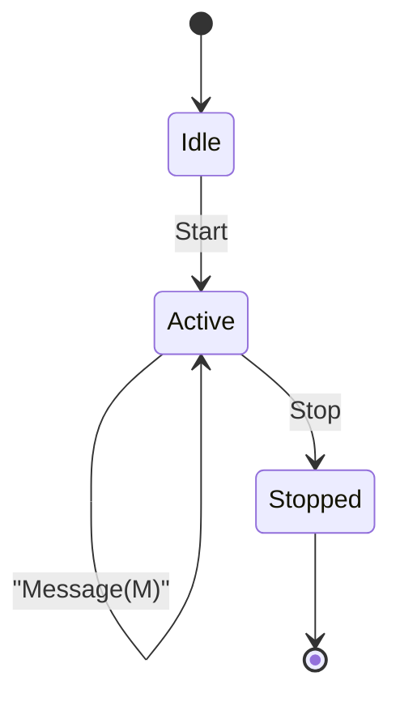

# Free Agent

A generic autonomous entity that communicates over NATS.

## What it is

`Entity<M>` is a typed, lifecycle-aware NATS subscriber. It listens on a subject, processes messages of type `M`, and follows a simple three-state lifecycle: **IDLE → ACTIVE → STOPPED**.

- **IDLE** — the entity is subscribed but ignores application messages until started.
- **ACTIVE** — the entity processes every incoming `Message(M)` by calling a user-supplied async handler.
- **STOPPED** — the entity drains its NATS subscription and exits cleanly.

## What you get

- **Typed wire protocol.** All messages on the subject are `Envelope<M>` — either a `Control` command (`Start` / `Stop`) or an application `Message(M)`, serialized as JSON.
- **Idle callback.** Optionally supply an `OnIdle` — a duration and a callback — that fires whenever the entity has been quiet for that long while active. Useful for heartbeats, retries, or polling loops.
- **Testable by design.** The NATS connection is injected via the `NatsConnection` trait. Production code uses `async_nats::Client`; tests substitute `MockNats` with no server required.
