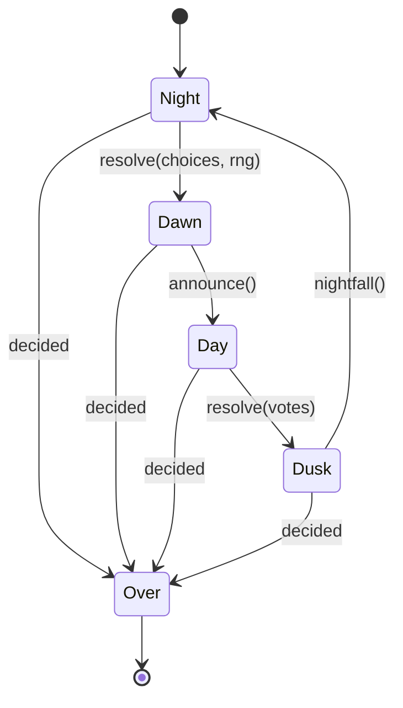

# Werewolf

The social deception game, played by [free agents](../../crates/free-agent).

Each player is an actor with its own task and its own memory, so a player
knows only what it has been told. An environment actor runs the game: it wakes
whoever the phase calls for, asks them all at once, waits out one deadline for
the round, and applies whatever came back.

```sh
cargo run -p werewolf -- --players 8 --seed 42
```

One JSON object per line goes to stdout. That is the whole output, and it is
the record a model is trained on.

## The game

Play alternates between night and day:

| Role | Night | Day |
| --- | --- | --- |
| Werewolf | Names a victim. Knows the other wolves. | Votes. |
| Doctor | Names someone to save, themselves included. | Votes. |
| Seer | Names someone and learns their team. | Votes. |
| Villager | Sleeps. | Votes. |

The wolves' plurality names the victim, and **a tie among the wolves is broken
at random** — sparing everyone would let wolves who never agree keep a game
alive forever. The doctor cancels the kill by naming the same person. By day
the village needs a plurality to lynch, and a tie hangs nobody.

The wolves win on reaching parity, since at parity no vote can go against
them. The villagers win when the last wolf is gone.

Nothing else ends a game. Nearly every night kills someone, so one side runs
out soon enough. A game where that never happens — the wolves never choosing,
the doctor always guessing right — plays on until `--limit` stops the
episode.

## Observations, actions, policies

The vocabulary is reinforcement learning's, so that a model trained here
reads the same way as one trained on anything else built on free-agent:

| RL | Here | What it is |
| --- | --- | --- |
| Observation | `Observation` | The round, the phase, who is alive. What the environment will tell this player. |
| Action space | `ActionSpace` | Who this player may name, which the environment enforces. |
| Action | `Action` | The one player named. |
| Agent state | `State` | What the player remembers across turns — a seer's readings, a werewolf's allies. |
| Policy | `Policy::decide` | State and observation in, action out. |

Every action, for every role, is **naming one living player**. Speech will
join the action space later, which is why `ActionSpace` is a type rather than
a bare list.

A player is an `Agent<P: Policy>`. The agent does everything that does not
vary — watching its channels, folding what it hears into its `State`,
answering inside the deadline — and calls the policy for the decision alone:

```rust,ignore
pub trait Policy: Send + 'static {
    fn decide(&mut self, state: &State, observation: &Observation, space: &ActionSpace)
        -> Result<Action>;
}
```

`Random` is the baseline: it ignores the observation and picks uniformly from
what `State::worth_considering` leaves. Heuristic and LLM policies differ from
it only in `decide`.

Three things decide what a player does, and they belong in different places:

- **Legality** is the rules, enforced by the environment. A wolf does not eat
  its own, a seer does not read itself. It arrives as the `ActionSpace`, and
  an action outside it is logged `silent`.
- **Sense** is `State::worth_considering`: a seer gains nothing by reading
  someone twice. Advisory, and every policy wants it.
- **Choice** is the policy. That is the only part a new player replaces.

## The rules as a state machine

A round walks through four types, and each transition consumes the one
before:



Every transition returns `Step<S>` — either `Going(S)` or `Over` — so any of
them can end the game and a finished game cannot be stepped. There is no
method on `Night` that counts votes and none on `Day` that resolves a kill:
the compiler enforces the order.

## The log

Every line is `{at, actor, payload}`, where the payload is one `Event`. An
`acted` event carries the role that acted and the full set of choices it had,
because an action without its action space teaches nothing. The log also
records the hidden truth — who is really a werewolf — which no player ever
sees.

A player that misses the round deadline, or names someone it was not offered,
is logged as `silent` and simply does not act. One slow player cannot hold up
a round.

## Players

`Random` is the baseline: it chooses uniformly among the choices it was
offered, minus whatever its own memory rules out. Seeding makes an episode
replay exactly, environment tie-breaks included.

Heuristic and LLM-driven players come next. They differ only in how they
answer a `YourTurn`.
