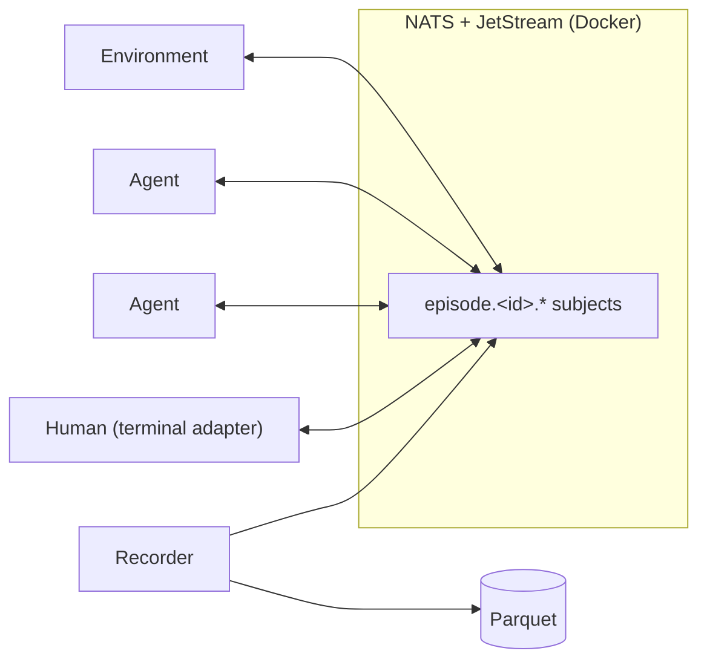
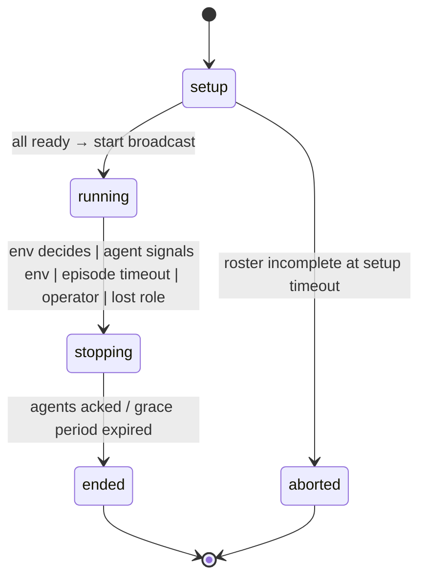
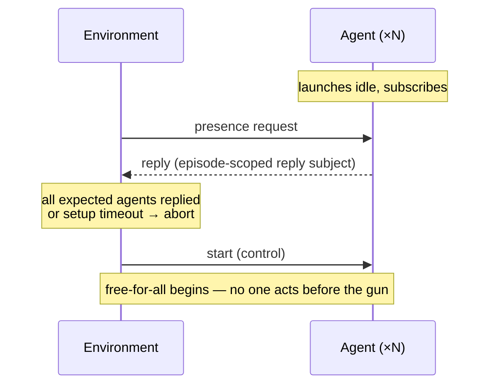

# FreeAgent — Design

**Status:** draft, living document. Decisions recorded here are settled unless marked *open*.

## What FreeAgent is

FreeAgent is a Python framework in which multiple LLM agents interact **without turn-taking**. An agent may speak or remain silent at any moment. Everything happens in real time: an agent on a faster machine reacts faster than one on a slower machine, and that asymmetry is part of the simulation, not a bug.

FreeAgent is a generic world simulator — dialogs, village simulations, games. It is not a reinforcement learning application, but it is designed to support RL: its core abstractions (environment, episode, agent) map directly onto RL nomenclature, and its logging exists to generate training data for multi-agent RL.

The library is **substrate, not policy**. It does not solve latency, decide when agents should speak, or enforce rules. It provides the medium in which application-level agents implement their own strategies for these problems.

Three further design principles. **Stochastic vs. programmatic is a per-application decision:** every application decides what is judged by an LLM and what is computed in code (in Twenty Questions: classifying an utterance is stochastic, counting questions is programmatic). The framework imposes no position. **Minimal application code:** the amount of code needed to implement an application like Twenty Questions should be as small as possible. The long-term goal — not reachable in v1, but the direction of travel for refactoring after a few applications exist — is that a basic application can be defined with text prompts alone. **Episodes run concurrently:** many episodes of the same application may run at once, isolated by subject root, with an eye toward bulk generation of training data. Nothing in the design may assume one episode at a time.

## Core concepts

An **agent** is an independent process with an event-handling loop. It takes input messages and produces output messages in the standard LLM fashion. Agents may run on different machines. An agent is *anything that speaks the NATS protocol* — which is how a human at a terminal adapter participates on the same footing as a machine.

An **environment** marries a set of agents to a NATS subject root. Interaction between agents is limited to sending and handling NATS messages under that root. Multiple environments run isolated from one another. An environment may maintain state and act as an intermediary that defines a shared reality for its agents, but this is not required — a simple environment is little more than a NATS subject plus lifecycle management. Lifecycle management is the irreducible minimum every environment provides; the framework provides no built-in state mechanism, so what state an environment keeps and how is entirely up to the individual application.

An **episode** is one run of an environment, from coordinated startup to shutdown. Episodes are one-and-done: to play again, you start over from the beginning. The episode ID is the unit of NATS routing, of logging, and of replay.

A **recruiter** assembles the roster *before* the episode exists — lobby, matchmaking, open enrollment, waiting for human players to wander in. It then hands a fixed roster to a freshly created environment. This keeps the environment's startup protocol singular and simple: known roster, everyone shows up in time or the episode aborts. V1's recruiter assigns the roster top-down from configuration; in the worker pool ([ADR-0005](decision-history/0005-the-worker-pool.md)) it is also the **enqueuer** — it turns that roster into the episode's set of manifests (one per role) and publishes them to the work queue, which is exactly the unit of work a pool of workers pulls and launches.

Agents are **cooperative with the framework**. Even in adversarial games they play by the rules. The environment coordinates; it does not enforce.

## Architecture

NATS (with JetStream enabled) is assumed to exist — typically a Docker container. It is not part of any FreeAgent process. This holds even once a persistent control service is running (see below): the service *verifies* NATS is reachable and fails with a clear error if it is not, but it does not embed NATS and, in v1, does not manage the container — bringing NATS up stays the operator's job. Optional container orchestration is deferred, and when it lands it will be opt-in so the default still honors "NATS is assumed to exist." Verifying that a dependency is reachable is not the same as owning its lifecycle.



Process types *within an episode*: one environment, N agents, and optionally a recorder that drains the episode's JetStream stream into a Parquet file. The recorder is library infrastructure (`freeagent.recorder`): the launcher spawns it as its own process per episode, but no agent or environment is required to use it — FreeAgent contains no *required* logging code. Recording is a per-run decision via the shared `--parquet-log PATH` CLI option (a new file, never overwritten); omit it and nothing is recorded. *Who* launches these processes — the CLI on one machine, or a pool of workers spread across many — is a separate question, taken up under [Who launches an episode, and where](#who-launches-an-episode-and-where).

JetStream is infrastructure. How streams are laid out (per episode, per application) is a deployment concern, not part of FreeAgent's abstraction surface, which ends at subjects and messages.

### Who launches an episode, and where

Launching an episode means starting that environment and those N agents as processes. There are two paths, built on one shared primitive (forking a child from a self-contained spec and supervising it at the OS level).

The `free-agent` CLI runs an episode **to completion** on one machine: it spawns the children, blocks until the environment exits, and returns an exit code. This is the single-machine path, unchanged.

The other path is the **worker pool** ([ADR-0005](decision-history/0005-the-worker-pool.md)), which exists because the goal is bulk generation of training data — *many* concurrent episodes, eventually across a server pool — and one process launching every agent on one machine cannot spread across machines. In the pool model, launching is split across three process tiers:

- **Service** (one long-lived process) — the localhost web API, shaped as `freeagent/<app>/<episode>`, a façade mapped at the API boundary only onto the unchanged wire subjects above (the dashed REST name `twenty-questions` maps to the undashed subject prefix `twentyquestions`); the NATS wire never changes, so a viewer cannot tell a pool-launched episode from a CLI-launched one. The service is **provision-only**: `create` does not launch anything and holds no handle. It discovers what to provision through each application's self-description rather than importing apps by name, asks the recruiter to enqueue the episode's work, and returns. `list`/`get`/`status` read the durable record (JetStream is the source of truth — a restart loses nothing); `stop` is the operator-abort described under [Episode lifecycle](#episode-lifecycle). The service is not required: an application runs perfectly well from the CLI alone.
- **Workers** (long-lived, ×M, stateless and identical) — a pool of generic, app-agnostic supervisors, each `free-agent work`. A worker pulls a **manifest** (the serializable unit of work — a role, a `module:QualName` class reference, the constructor config, the episode's subject root and ids, the NATS URL) off a shared JetStream **work queue**, forks one child process for that role, confirms it is up, acknowledges the message, and then supervises that child at the OS level for the rest of its life. A worker never runs agent code itself; over its life it hosts roles from *many* episodes.
- **Children** (short-lived) — exactly one role of one episode: one agent, or the environment. A child is launchable purely from its manifest. Agents run as **separate OS processes, not async tasks** sharing one: isolation over density — a wedged or crashing agent cannot take a neighbour down and can be `SIGKILL`'d.

Placement is the work queue itself: one work-queue-retention stream holds the manifests, all workers bind **one shared durable pull consumer**, and the server hands each manifest to exactly one worker (competing consumers). Pull, not push, so each worker fetches only as much as its spare capacity allows — distribution by capacity, with no central scheduler. Filling the queue and scaling the pool (`--scale worker=N`) is the whole execution model; the autoscaling signal, when wanted, is work-queue depth.

The manifest *references* code by import path; it does not carry code. So a worker that runs a manifest must have the named engine **installed** — workers are "fat" (library + engines), while the slim service launches nothing and needs no engine. This is the two-image backend (see [Repository layout](#repository-layout)). A manifest also records the **resolved engine version** once a child imports the class (e.g. `twentyquestions==1.2.3`), written into the episode's durable record as write-only provenance — the difference between an RL trajectory you can reproduce and one you cannot.

**Two control planes, and the worker lives in only one.** The episode's lifecycle runs **in-band over NATS**, environment-led, exactly as for a CLI-launched episode: presence → `start` → `shutdown`, with children conducting it autonomously (an agent hears `shutdown` and winds itself down). The worker is invisible here. **Out-of-band at the OS**, the worker does what only the holder of a PID can: fork, reap exited children, and escalate `SIGTERM`→`SIGKILL` on a straggler that ignores cooperative shutdown. The environment *decides* (broadcasts shutdown over NATS); the worker *enforces* on whatever will not leave. No durable, cross-machine process handle is ever stored — the durable record holds the manifest set, status, and resolved versions, never a PID.

## NATS subjects

(NATS nomenclature: these are "subjects", not "topics". FreeAgent uses "subject" throughout.)

Subject roots are prefixed with the application name, which both namespaces applications sharing a NATS server and keeps concurrently running episodes isolated:

```
<app>.episode.<id>.public            broadcast channel — the room
<app>.episode.<id>.agent.<name>      per-agent inbox (environment or agents address subsets)
<app>.episode.<id>.control           lifecycle: start / shutdown (environment → agents only)
<app>.episode.<id>.env               environment's inbox: app-defined agent → environment management messages
<app>.episode.<id>.reply.<req-id>    replies to environment-originated requests
<app>.episode.<id>.log.<name>        optional log-only telemetry; no agent subscribes
```

Application code never touches raw subjects: agents address messages to sets of agent IDs (default broadcast), and the runtime maps IDs to subjects.

One JetStream stream per episode captures `<app>.episode.<id>.>`. Stream sequence numbers provide the authoritative total order; what each agent *experienced* is a different (and equally valid) order.

## Messages

There is no fixed message format beyond a minimal envelope. Specific environments define richer formats on top.

| Field            | Type | Notes                                          |
|------------------|------|------------------------------------------------|
| `message_id`     | 𝕊    | unique per message                             |
| `episode_id`     | 𝕊    |                                                |
| `sender`         | 𝕊    | agent name or environment                      |
| `payload`        | app-defined | opaque to the framework                  |

The envelope carries no timestamp. All timing comes from JetStream's server-assigned metadata — one clock for the whole episode, immune to skew across agent machines. The sequence number is the ordering truth; the server timestamp is for duration math. Senders that want to report local timing (e.g. inference start/end) do so in payloads or log-only telemetry, where it is explicitly app-defined and machine-local.

## Episode lifecycle



**Control flows one way.** The environment controls the lifecycle; agents hear and obey control messages but never send any on the control subject. When the environment needs information from an agent, it uses a **request/reply** exchange that always originates from the environment. Agents *can* send application-defined management messages to the environment's inbox — the canonical example being an agent telling the environment the episode is over (the Twenty Questions Host does this). Lifecycle authority still rests with the environment alone; the inbox message is information, the control broadcast is the decision. Replies must use episode-scoped reply subjects (e.g. `episode.<id>.reply.<request-id>`), not NATS's default `_INBOX.>` subjects — otherwise replies escape the episode's JetStream stream and break the wire-is-the-log invariant.

Baseline control vocabulary: `start` and `shutdown`, broadcast on the control subject. Everything else is application-defined.

**Coordinated startup.** Agents launch in idle mode and wait. JetStream removes the classic lost-message hazard: every agent's consumer reads the episode stream from sequence 1, so nothing can be missed, only delayed. The environment confirms the roster by request/reply, then fires the gun:



**Shutdown** has five triggers, all first-class: the environment decides, an agent signals the environment via its inbox (game over), the episode timeout fires (owned by the environment's clock), an external operator intervenes, or **a role is lost**. The operator (the control service's `stop`) intervenes by *requesting*, not commanding: it sends an `freeagent.abort` message on the environment's inbox (`<id>.env`), and the environment takes its normal stopping path but settles in `aborted` rather than `ended` — never by killing the environment process, which would skip the broadcast and strand agents.

The **lost-role** trigger is the worker pool's liveness backstop ([ADR-0005](decision-history/0005-the-worker-pool.md)). A worker that dies *after* acking takes its child with it: in the one-process-per-container model the queue does not redeliver, so the role simply **vanishes** from a live episode. The environment notices through the same presence machinery that confirmed the roster at setup — during `running` it periodically re-probes presence, and a member that was present but stops answering past a deadline is *lost*. A lost role drives the episode down its normal graceful-abort path to `aborted`. Crucially, **no role is ever re-run into a live episode**: a re-run role rejoining would be the duplicate-join the presence-nonce check is built to reject, so the only correct response to a lost participant is to abort the episode cleanly, not to respawn. (The re-probe interval and deadline are operator-settable environment config.)

In every case the environment broadcasts `shutdown` on control, agents wind down cooperatively, and the environment optionally publishes an outcome record as the episode's last word. Per-phase timeouts (e.g. "answer within 30 s") are application policy built on a library timer primitive, not framework structure.

## Logging

There is a single logging mechanism: **the wire is the log**. All messages sent during an episode are recorded to one Parquet file. Parsing of that raw data happens separately; applications may ship custom log parsers.

The recorder drains the episode's JetStream stream — total order from stream sequence, no risk of slowing live play. The Parquet schema is raw and wide; payloads are stored unparsed:

| Column | Type |
|--------|------|
| `episode_id` | 𝕊 |
| `stream_seq` | int |
| `subject` | 𝕊 |
| `sender` | 𝕊 |
| `received_at` | timestamp (JetStream, server clock) |
| `payload` | bytes / JSON 𝕊 |

Anything interesting that doesn't naturally touch the wire — LLM call records, "considered speaking, chose silence," timing marks — can be published to the optional log-only subjects so the single mechanism still captures it. Silence is an action; latency is part of the observation. Agent-side telemetry of this kind is optional and lives in application code or opt-in library helpers, never as required framework machinery.

## RL support

Episodes, per-agent trajectories reconstructable from the log (using arrival timing to recover what each agent knew when it acted), and outcome records give the raw material for multi-agent RL training data. Rewards are defined entirely by the application; nothing is built into the message envelope.

## Agent internals

### The minimum agent class

| Member | Signature | Role |
|--------|-----------|------|
| constructor | environment subject root: 𝕊, id: 𝕊 → Agent | |
| `id` | Agent → 𝕊 | unique within the episode |
| `perceive` | Agent → message: M → Agent | in-world message handler |
| `act` | Agent → message: M → recipients: {𝕊} → None | queue an outgoing message; recipients are agent IDs, default broadcast |
| `control` | Agent → message: M → Agent | out-of-band management messages, separate from in-world traffic |

The signatures are intended functionally: a return value of Agent means the agent's state changes. `act` is the unavoidable outlier — it has an effect on the world (in the Scala sketch that preceded this design, it was monadic). Handler interfaces are `async def`; we prefer functional style but do not work against the language.

An application minimally defines `perceive`. `act` and `control` have default implementations; applications override `control` for custom management messages, calling super so the framework's lifecycle handling (idle → active on `start`, wind-down on `shutdown`) still runs. Agents never send control messages — they only obey, and answer environment-originated requests.

Agent IDs are human-readable and must be usable within a NATS subject: `[A-Za-z0-9_-]+`, validated by the constructor. The name `env` is reserved for the environment.

### Concurrency model: the agent is a fold

An agent's life is a fold over a single, locally ordered event stream: in-world messages, control messages, and internal "think" messages merged into one sequence, processed one handler at a time on one asyncio loop — no threads. This local event sequence is exactly the agent's RL trajectory; echoed to the log subjects, it makes the agent's experience replayable.

The hard rule that makes this work, stated here so it ends up prominent in user documentation: **handlers are fast and non-blocking.** An LLM call never happens inside a handler. Slow work is spawned as an asyncio task whose completion is posted back to the think queue as an ordinary internal message. All the messy asynchrony lives between folds; the fold itself stays simple.

The latency strategies the library deliberately does not solve are all expressible under this discipline, application-side:

- *Reconsider an in-flight thought*: when the spawned LLM call's completion arrives as a think message, the handler compares it against current state and may discard it as stale.
- *Drain the inbox into one call*: `perceive` just accumulates state; a think event decides when to spend an LLM call on everything seen so far.
- *Fast gatekeeper model*: periodic think messages invoke a small, fast "act or stay silent?" model; only a yes escalates to the slow model.

### The outbox

`act` does not publish. It appends to an outbox that the runtime flushes after the handler returns. Handlers therefore stay referentially transparent — same state plus same event yields the same new state and the same outbox — which makes unit testing and replay exact. It also gives a structural guarantee: an agent's outgoing messages are published at handler boundaries, never interleaved mid-thought.

The think queue is not behind the outbox: handlers (and spawned tasks) write to it directly. It is internal state, not an effect on the world.

### The think queue (library base class)

A standard pattern, shipped as a base class on top of the minimum agent: an internal queue of self-addressed messages, constantly drained and processed through the same event loop as external messages, with support for delayed/periodic scheduling. What an agent posts to it is its own business — LLM completions, timers, "decide whether to act" prompts.

Environments, unlike agents, do not need a think queue; their job is coordination, state, and lifecycle.

## Environment internals

The base Environment is the same fold model as the agent — a single locally ordered event stream processed one handler at a time — with three differences.

**No think queue, but timers.** An environment's internal events are scheduled timers (setup timeout, episode timeout, grace period), which enter its fold like any message. Applications can schedule their own (e.g. per-phase timeouts).

**A different constructor.** Where an agent takes a subject root and its assigned ID, an environment takes what it needs to *create* the episode: application name, episode ID (or generates one), the roster of expected agent IDs, and timeout configuration.

**It owns the lifecycle.** The base class implements the whole state machine — presence confirmation by request/reply, `start` and `shutdown` broadcasts, timeout-driven aborts — so a minimal environment is the base class plus a roster, zero overrides. Its `perceive` handles in-world traffic and inbox messages; an application overrides it for the few messages it cares about (the Twenty Questions environment reacts to exactly one: the Host's end-of-episode signal). Environments send through the same outbox mechanism as agents, plus helpers for control broadcasts and request/reply.

**Naming.** Name choice is another initialization coordination challenge, alongside coordinated startup. Agent IDs are assigned top-down — by the runner's configuration in v1, by a recruiter later — never chosen by agents themselves. Uniqueness is therefore a configuration-validation problem, not a distributed-coordination one. As a sanity check, presence replies carry a per-process nonce, so the environment detects two processes launched under the same name and aborts.

**Presence is also a running-state liveness check.** The same presence request/reply that confirms the roster at setup is re-used during `running` to detect a participant that *vanishes* mid-episode — the worker pool's lost-role case (see [Episode lifecycle](#episode-lifecycle)). A periodic re-probe with a response deadline distinguishes a genuinely-absent role (abort) from one that is merely silent-but-alive (fine — silence is an action), and the per-process nonce keeps a re-run role from masquerading as the original. This is the runtime-protocol last resort the pattern below reserves for what only runtime can know: not just who showed up, but who is *still here*.

A general pattern, to be followed when new initialization concerns appear: solve coordination problems at configuration time (roster, names) or in infrastructure (JetStream replay) wherever possible; runtime protocol is the last resort, reserved for what only runtime can know (who actually showed up).

## Repository layout

`uv` workspace shared by the library and applications. The library is installable on its own.

The **`free-agent` CLI** launches everything an episode needs — environment, agents, optionally the recorder — with one command instead of six terminals. The convention is `free-agent [--log-level LEVEL] APP COMMAND ...`. The launcher is library code: `freeagent` provides the Typer root (it owns the shared `--log-level` option), the shared `--parquet-log` recording option, the episode-tunables config loader, and the orchestration that spawns and supervises the child processes. Each application provides what it *is* — its name, its environment class, and its roster (agent name → agent class) — in source, and advertises it through the `freeagent.apps` entry-point group as an `AppSpec`: the same identity plus the settable config surface (which `config` fields an operator may set, as plain wire-safe data, no class references) and the app's Typer sub-app. The root CLI mounts the sub-app; a generic launcher (the control service) loads an `AppSpec` by its dashed REST name and gets everything `run_episode` needs without importing the app by name. Installing an application makes `free-agent APP ...` work; the library never imports its applications by name, and applications may add whatever other commands they need.

Alongside the per-app `run` command, the library root carries two app-agnostic, top-level commands that together make up the **worker-pool backend** ([ADR-0005](decision-history/0005-the-worker-pool.md)): `free-agent serve` (the provision-only episode service) and `free-agent work` (a worker). The one `freeagent` library ships as **two images**, not two packages:

- the **service (slim)** image — the library only, *no* engines, the web stack behind a `service` extra. It launches nothing, so it needs no engine; it owns the REST/feed surface.
- the **worker (fat)** image — the library **plus** the installed app engines, running `free-agent work`; it needs none of the web stack.

Workers are stateless, publish no ports, and carry no `container_name` (which would forbid replicas), so the pool scales by replica count — the same image at `replicas: 1` on a laptop and `replicas: N` on a cluster. The repository's `docker/compose.yml` brings up NATS (internal), one service (the only published port), and a scalable `worker` service on one private network; `docker/` therefore holds both image definitions:

```
free-agent/
├── pyproject.toml          # uv workspace root
├── packages/
│   └── freeagent/          # the library: CLI root + launcher, episode recorder, service, worker
├── apps/
│   └── twentyquestions/    # sample application (its own `free-agent` sub-app)
└── docker/
    ├── nats/               # NATS + JetStream container config
    ├── freeagent/          # the slim service image
    └── worker/             # the fat worker image
```

A `*.yml` passed to a command carries only per-episode tunables — the NATS URL, the episode id, and each component's verbatim `config` — never class references or the roster (which live in source), and never the recorder (which is the `--parquet-log` CLI option). This keeps what an application is in code that the type checker and tests see, and keeps configuration to the dials an operator actually turns between runs. Batch generation of training data (many concurrent episodes) builds on the same foundation later.

## LLM infrastructure

LLMs are used so pervasively that FreeAgent builds in LLM infrastructure, even though no application is required to use it:

- An async LLM client wrapper over litellm, used via the spawn-don't-block pattern: the call runs as a spawned task and its completion re-enters the agent's fold as a think message. The model is configurable as a single litellm model string, resolved in order: explicit argument → episode yml → `FREEAGENT_MODEL` env var → auto-detect (pick the cheapest tier of whichever provider's API key is present in the environment) → a clear error naming the env vars checked. The default should be cheap and work automatically for anyone whose shell already has a provider key. Structured outputs (e.g. the Host's classification verdicts) are requested as JSON schema and validated with Pydantic models.
- Automatic optional telemetry: each call's prompt, completion, and timing published to the agent's log-only subject — which is how silence decisions become training data.
- An `LLMAgent` base class: an agent defined primarily by text prompts. It maintains the transcript of perceived messages as state and delegates to prompts the decisions of when and what to say. This class is the road to the "applications from text prompts alone" goal.

## Testing

FreeAgent's unit tests include a simple application that uses no LLM (a Collatz conjecture app): deterministic, fast, free, and it exercises the full stack — lifecycle, messaging, the fold, the outbox — without network calls to a model provider.

## Sample application: Twenty Questions

Two kinds of agents: several **Players** and one **Host**. The environment is very minimal and holds no game state.

The Host knows the secret object — specified on the command line or chosen randomly from a canned list — and answers questions. Everything judgment-shaped is done with LLMs: the Host decides whether an utterance counts as a question (as opposed to Players deliberating), whether a guess is correct, and when the game is over. The question count lives in the Host's agent state, incremented when its LLM classifies an utterance as a question — classification by LLM, bookkeeping in code.

All speech is broadcast; there is no directed speech. Players deliberate among themselves on the public channel to choose the right next question rather than burning through their 20 — and it is the Host's job to know when Players are talking among themselves instead of asking or guessing.

The episode ends three ways: a correct guess (Players win), the budget exhausted (Players lose), or episode timeout. The Host announces the outcome in-world on the public channel — this announcement is the episode's outcome record in the log. Hearing it, saying goodbye, and leaving are part of the Player prompt. (Closeout protocols are hard to write: "wait until everyone has said goodbye" is an infinite regress, since someone must acknowledge the last goodbye. Conversational interactions work great except at the boundaries — a hard fact about conversations, which is why shutdown timing is the grace period's job, not an LLM judgment.) The Host then tells the environment the episode is over via the environment's inbox; the environment broadcasts `shutdown`, and the stopping phase's grace period is what gives Players room to finish their goodbyes.

Code goal: as little as possible. Players and the Host are `LLMAgent` subclasses defined almost entirely by their prompts. What the episode demonstrates: real-time non-turn-taking (Players racing and deliberating concurrently, the Host serializing what it hears in arrival order), and per-agent trajectory logging.

The split of functionality between Twenty Questions and the library is provisional: get it right once, then revise when the second application exists and the real seams show.

Human participation is a non-goal for v1. (The terminal adapter remains a library concept; it is just not part of this application's v1.)

## Open questions

None currently — ready for v1 implementation.
