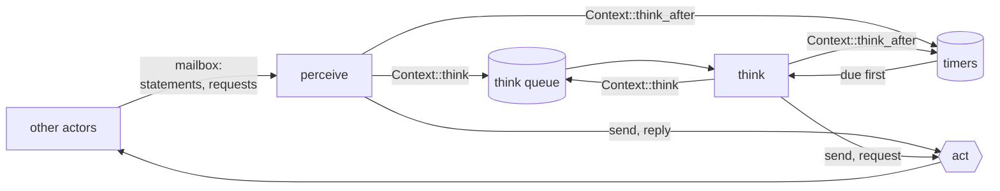
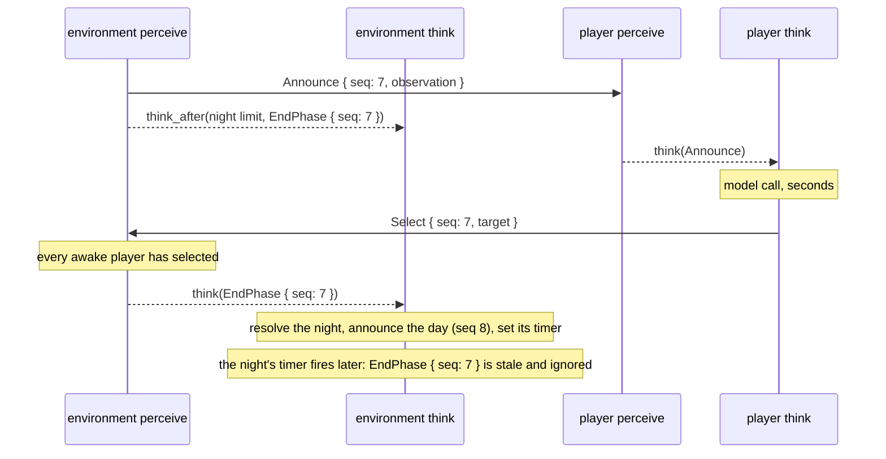

# ADR-0002: Actors perceive, think, and act

**Status:** Accepted
**Date:** 2026-10-09
**Deciders:** Bill McNeill

## Context

In `free-agent` 0.1.0, an actor is a `Behavior` driven by a mailbox. Its
message loop, `Actor::run`, waits in a `biased` `tokio::select!` on three
things, in order: its shutdown token, the episode's start signal, and its
mailbox. For each envelope it takes from the mailbox it awaits one step of
the behavior: `receive` for a statement, `answer` for a request, whose
result is sent back as the reply. It takes nothing else from the mailbox
until that step has finished. An actor that sends to itself puts the message
in its own mailbox, behind whatever is already there.

That shape was built against players that choose at random and answer in
microseconds. The next piece of work is a Werewolf played by language
models, and a model call takes seconds. If the call runs inside a step, the
actor is deaf for those seconds:

- **It cannot perceive.** Statements pile up in its mailbox and are handled,
  all at once, when the call returns. When something arrived is information
  in a game played in real time, and the loop erases it exactly when the
  game is busiest.
- **It cannot react.** A request that needs only a fast answer waits behind
  the model call.
- **Request and reply bring the latency back.** An environment that asks for
  a choice with a request waits on the slowest model, and a player can only
  send its choice in a reply, so it cannot hand the decision to anything
  slower than its own step.

A minimal model-played game, in which every phase waits for every model,
would not notice any of this. But that is not the game being built, so the
plumbing for high latency comes first.

The principle is thinking fast and thinking slow. Fast work, such as taking
in a message, making a simple decision like the random player's, or handing
something off, should never wait on slow work, such as a model call.

## Decision

**An actor does three things: it perceives what comes in, it thinks about
what to do, and it acts by sending messages out. Perceiving is today's
message loop, `perceive`. Thinking is an optional second loop, `think`, run
by the library as a long-lived Tokio task with a queue of its own. Acting is
not a loop of its own: it is every send and reply either loop makes. The two
loops share one state.**



### Perceive

`perceive` is the message loop of 0.1.0 under a new name, unchanged: it
waits on its shutdown token, the start signal and its mailbox, and hands each
envelope to `receive` or `answer`. It does fast work: it receives
statements and requests, makes fast decisions, sends statements, answers
requests, and hands anything slow to `think`.

**Perceive does not loop back.** Nothing an actor does arrives in its own
mailbox. `send` addressed to the actor itself becomes an error, as `request`
addressed to itself already is. Everything an actor wants to come back to
later goes to `think`.

**Only perceive replies.** A reply is the result of an `answer` step, so
nothing else can produce one. This enforces the rule that a reply is an
actor's reflex response: fast by construction, because a slow answer would
hold up the perceive loop for everyone.

### Think

An actor opts into a think loop with a new field on its `ActorInit`, a
builder like `behavior`, because the think loop has a `Context` of its own:

```rust
pub struct ActorInit<B: Behavior> {
    pub behavior: Builder<B>,
    pub think: Option<ThinkBuilder<B::Message, B::Log>>,
    pub can_send_to: HashSet<ActorId>,
    pub can_shut_down: HashSet<ActorId>,
    pub has_logger: bool,
}

pub type ThinkBuilder<M, L> =
    Box<dyn FnOnce(Context<M, L>) -> Box<dyn Think<Message = M>> + Send>;

#[async_trait]
pub trait Think: Send {
    type Message: Message;
    /// Think about `message`, acting through this loop's `Context`.
    async fn think(&mut self, message: &Self::Message) -> anyhow::Result<()>;
}
```

An actor with `think: None` has no think loop and pays nothing for the
feature. The think loop's `Context` has the same id, permissions, logger and
shutdown token as the perceive loop's, so `think` can do anything `receive`
can: send statements, make requests and await their replies, stop the
actors it may stop, and hand itself more to think about. It cannot reply,
since it never holds a request.

The library owns the loop. It takes one message at a time, a due timer
before anything on the think queue and the think queue in the order its
messages arrived, and awaits `think` on it. A model call is
an ordinary `.await` inside `think`, so `perceive` keeps running while it is
pending.

- **Messages pile up.** One that arrives while `think` is running waits its
  turn. Nothing is cancelled, merged or skipped. When to abandon work
  already under way is an open design problem, and not one this record
  solves.
- **A failure is brain damage.** If `think` returns an error, the library
  drops it. It is not logged and it does not stop the actor; the loop goes on
  to the next message. A model that fails to make a selection has simply not
  made one.

`Context` gains two methods, callable from either loop:

- **`think(message)`** puts `message` on the actor's think queue without
  waiting. From `perceive` it hands work off; from `think` it loops back.
  It fails, as `send` fails for an actor it may not reach, when the actor has
  no think loop.
- **`think_after(delay, message)`** sets a timer that hands `message` to
  `think` once `delay` has passed. It fails in the same case.

### Timers belong to think, and jump the queue

Every timer is a delayed thought. None reaches `perceive`.

The think loop keeps its timers in a `tokio_util::time::DelayQueue` and waits
in a `biased` `select!` on four arms, in this order:

1. its shutdown token,
2. new timers, which it inserts into the `DelayQueue` and goes back to
   waiting,
3. the `DelayQueue`, whose next due timer it hands to `think`,
4. the think queue, whose next message it hands to `think`.

A due timer is therefore handled before anything already waiting on the
think queue. It still waits for a `think` in progress to finish: nothing
interrupts a model call.

New timers come in on a channel of their own rather than on the think queue,
so that one set while the queue is long is not stuck behind it, unseen,
past its deadline. And `think_after` turns its delay into a deadline when it
is called, which the loop inserts with `insert_at`. A timer set while
`think` is busy is due when it was meant to be, not that long after the
loop gets round to inserting it.

A timer cannot be cancelled. An actor that no longer wants one recognizes it
when it arrives, usually by a sequence number it put in the message, and
ignores it.

### Act

Acting is every message an actor sends and every reply it makes. There is
no act loop in the code. Each send goes straight down the recipient's
mailbox sender, and each reply down its request's reply channel. Together,
the sends of `perceive` and `think` form one virtual outgoing queue for the
actor, interleaved in the order they happen. That interleaving is the
actor's record of what it did, and nothing orders it further.

### One brain

An actor's state is its brain, and it has one. The two loops run
concurrently, so they cannot both hold `&mut` to the same fields: a `think`
holding `&mut self` across a model call would lock `perceive` out of the
state for the length of the call. Instead, the application makes one
`Arc<std::sync::Mutex<S>>` and gives a clone to the behavior and to its
`Think` when it builds them. A step locks, reads or writes, and unlocks; a
`think` locks to build its prompt, unlocks, awaits the model, and locks again
to record the result.

A `std::sync::MutexGuard` is not `Send`, so a future that holds one across an
`.await` cannot be spawned on the multi-threaded runtime. The compiler
therefore rejects the one mistake this design invites, holding the lock
across a model call. The library never sees `S`.

### One shutdown

The actor's one cancellation token stops everything at once: `perceive`,
`think` with any call in progress, and every pending timer. A player killed
in the middle of a model call never acts on its result.

### One message type

Both loops, the think queue and the timers all carry the actor's one message
type, `B::Message`. A message on the think queue says by its content why it
is there.

### Stale messages are caught by sequence numbers

Without a reply tied to its request, a slow answer can arrive after it has
stopped mattering, such as a night's selection landing during the day. The
application catches this. A message that expects an answer carries a
sequence number, the answer echoes it, and a receiver that has moved on
drops anything with a number other than the one it is waiting for. Timers
are caught the same way.

A library mechanism for pending messages, threaded through the whole actor,
is expected eventually. It is not built until an application shows what it
should look like.

### Werewolf played by models

Under this architecture, the model-played variant of Werewolf
([ADR-0001](0001-games-and-variants-are-modules-and-subcommands.md)) works
as follows. The working names of its new messages are `Announce { seq,
observation }`, `Select { seq, target }` and `EndPhase { seq }`.

- **Statements both ways.** The environment announces a phase by sending
  each awake player an `Announce` carrying its `Observation` and the phase's
  sequence number. A player sends its selection to the environment as a
  `Select` that echoes the number. Players can send to the environment.
- **The environment perceives selections and thinks about phases.** Its
  `start` announces the first night and calls `think_after` with the night's
  limit and an `EndPhase`. Its `receive` records each `Select` whose number is
  current, and once every awake player has selected, calls `think` with an
  `EndPhase`. Its `think` handles `EndPhase`: if the number is current, it
  resolves the phase, announces the next and sets its timer; if not, the
  phase has already ended and the message is ignored. Phases are resolved in
  one place, whichever of the two ways a phase ends.
- **A phase ends when every awake player has selected, or at its limit,
  whichever is first.** A player's first selection in a phase counts and
  later ones are ignored. Changing one's mind, quiet periods and the hammer
  come later.
- **A model player perceives announcements and thinks about them.** Its
  `receive` hands each `Announce` to `think`, which calls the model and
  sends the `Select` to the environment itself.
- **A fast scripted player that speaks statements** lives beside the model
  player. It answers an `Announce` with a `Select` from `receive` and has no
  think loop, so that the model-played environment can be tested end to end
  without a model.
- **The uniform-random variant does not change.** Its actors have no think
  loop, and it keeps request and reply.



## Alternatives considered

### Run the model call inside a step

The minimal game. Rejected for the reasons in the context: the actor is
deaf and unresponsive for the length of every call.

### Think reports back to perceive

An earlier version of this record. `think` returned what it concluded, and
the library put it on a thoughts channel that `perceive` read with a
`recall` method, as it did timers and messages to itself; only `perceive`
sent anything. Rejected because it made thoughts into perceptions: a third
channel and a fourth arm in `perceive`'s `select!`, every slow result taking
a hop through the fast loop on its way out, and no clean answer to who
holds a timer. Letting `think` act for itself removed the channel, the arm,
the hop and `recall`.

### Keep request and reply, and defer the reply

`perceive` puts an open request aside and replies once `think` concludes. It
keeps the request's tie to its answer, but the library would have to hold
requests open across steps and let `think` reply, breaking the rule that
replies are fast. Rejected for now in favor of sequence numbers, which need
nothing from the library.

### Timers in perceive

A timer is time passing in the world, and could be delivered to the mailbox
like any other perception. Rejected: it is the actor's own message to
itself, and perceive does not loop back.

### Timers as sleeping tasks

`think_after` spawns a task that sleeps and then puts its message on the
think queue. Less code, and no timer arm. Rejected because a timer would
join the back of the queue when it fired and be handled after everything
already waiting, and a phase deadline has to jump that backlog.

### Timers on the think queue

One inbound channel for the think loop, carrying messages to think about
now and timers to set, with the loop moving timers into its `DelayQueue` as
it reads them. Rejected because a timer set behind a long queue would not
reach the `DelayQueue` until the loop had worked through everything ahead of
it, and could be overdue before it was ever set.

### Two brains

Each loop owns the part of the state it uses, and they keep each other
informed with messages. Simpler, with no locks, but it splits what is one
agent's state between two owners. Rejected for the shared mutex, which keeps
one brain and whose one hazard the compiler catches.

### The think loop as an associated type of `Behavior`

Rejected because an episode holds one behavior type, so every application
with two kinds of actor would need a second dispatch enum beside the one it
already has. A boxed trait object costs nothing next to a model call.

### A failed thought fails the actor

Rejected. A model's failure is the player's failure to act, not a fault in
the episode, and it should not end the game.

## Consequences

- **Perception keeps going while an actor thinks.** Messages are received,
  and can be answered, while a model call is pending.
- **`perceive` is unchanged.** An actor without a think loop is written
  exactly as before, and the loop it runs is 0.1.0's.
- **An environment with timers needs a think loop.** Even one whose rules
  are all fast, like the model-played environment, keeps its clock in
  `think`, and so shares its state behind a mutex.
- **A slow player can fall behind.** With messages piling up, a model player
  may still be thinking about the night when the day is announced. Its late
  selection is dropped by sequence number. Deciding when to abandon stale
  work is left for later.
- **A timer jumps the backlog but not a call in progress.** A due timer is
  the next thing `think` handles, but a model call already under way runs to
  the end first. A phase deadline can land late by up to one model call.
- **Failures in think are invisible.** A model call that fails, or returns a
  malformed tool call, leaves no trace until think logs. Its `Context` has
  the actor's logger if the actor has one, so this is a decision deferred,
  not a capability missing.
- **Every state access in an actor with a think loop goes through `lock()`.**
  Critical sections are short and the compiler keeps them from spanning an
  `.await`.
- **A send to oneself is now an error.** Code that sends to itself, such as
  the uniform-random variant's `Mute` test fixture, has to change.

## Deliberately deferred

1. **Logging from think.** How it should be done will be clearer once more of
   the plumbing is in place.
2. **Abandoning work under way,** including cancelling a model call in
   progress.
3. **A library mechanism for pending messages.**
4. **Talk,** and how players avoid talking over one another.
5. **Changing one's selection, quiet periods and the hammer.**
