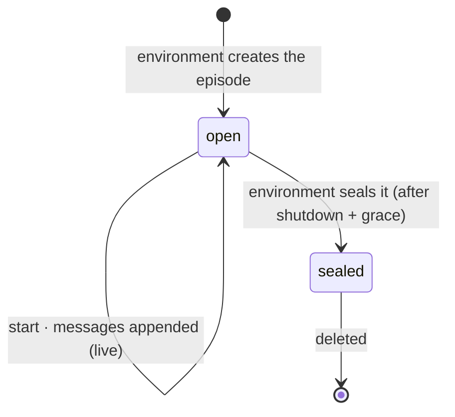
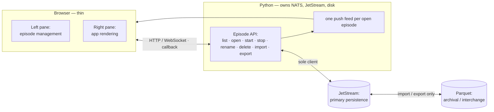
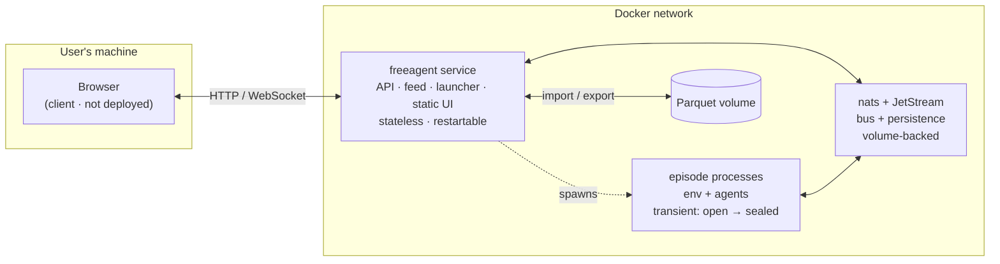

# ADR-0003: The atemporal episode

**Status:** Accepted (partially superseded by
[ADR-0004](0004-app-independent-service.md))
**Date:** 2026-06-23
**Deciders:** Bill McNeill
**Supersedes in part:** ADR-0001 (browser-subscribes-to-NATS; replay as Parquet
re-publication onto a second NATS; the read-only viewer) and ADR-0002 (the
in-memory registry as the source of truth for what episodes exist). The wire
contract, monorepo layout, schema-as-contract, engine fold model, control
primitives (`EpisodeHandle`, `AppSpec`, operator-abort), and the REST-façade
boundary from those ADRs all stand.

> **Note (superseded in part):** this ADR makes the `freeagent` service both the
> **host of the static UI bundle** (one origin to the browser) and the episode
> **launcher/supervisor**. [ADR-0004](0004-app-independent-service.md) supersedes
> the UI-hosting decision: the service is now an **app-independent** REST/JetStream
> API that serves no UI and bundles no application, and a UI is a separate host
> process that calls it cross-origin. Everything else here — the JetStream-resident
> episode, sealing, the per-episode feed, Parquet edge I/O, and the REST contract —
> still stands. (Removing the in-process launcher/supervisor is tracked separately;
> see ADR-0004.)

## Context

ADR-0001 (a viewer) and ADR-0002 (a control service) designed the **upper edge**
of FreeAgent — everything above the engine, where persistence, episode identity,
and the UI live — sight unseen. A working visual prototype now exists, and reading
its affordances (not its source) prompts a reframe of that upper edge. The wire
below is unchanged; the agent/environment fold model is unchanged. What changes is
how an episode is *conceived, persisted, bounded, and observed*.

The reframe rests on a single idea, from which everything else follows: **the
episode is the first-class concept, and it is atemporal.**

Several forces push the same direction:

- **Writers live in time; readers see a value.** Production is irreducibly
  temporal — real-time, non-turn-taking, latency-is-observation. But what
  production *produces* is a complete, ordered record. The temporal world and the
  atemporal record are two different things, and conflating them is what made the
  first cut awkward (a "replayer" that re-enacts time, a viewer that distinguishes
  live from replay).
- **JetStream already holds every message.** "The wire is the log" already leans
  on JetStream as the durable store. Make that explicit rather than incidental:
  JetStream is the primary persistence, and episodes live there until they are
  purposefully deleted.
- **The prototype treats episode management as first-order.** Browse, open,
  replay, delete, rename — across applications, with friendly names, never raw
  UUIDs.
- **The UI should be as dumb as possible.** The episode, its interaction with
  NATS, and the disk all belong in Python.
- **Fewer edges is better.** The JavaScript / WebSocket / REST / Python /
  JetStream graph should have as few crossings as we can manage; when an
  implementation question is otherwise a toss-up, prefer the answer that removes a
  boundary.

## Decision

### The episode is a first-class, atemporal value

An episode is an ordered set of timestamped envelopes plus metadata (a friendly
name, the application, a status). It is **atemporal**: everything in it is present
at once, with no playback clock and no notion of "now" inside it. Time is not
discarded — it is *relocated from process to data*. Every message keeps its stream
sequence and its server timestamp as fields, so per-agent trajectories and "what
each agent knew when" remain reconstructable (the RL story is untouched). What is
deleted is **playback as a process** — there is no playback speed, no pause, no
seek. If real-time playback is ever wanted, it is a *presentation view* layered
over the atemporal value, never a property of the value. For now it is YAGNI.

Two time-domains, then, and the stipulation touches only one:

Production is temporal and lives in the `open` state's churn; the episode-value is
atemporal and is what a reader sees at any instant. JetStream is precisely the
bridge between them — append-only as it is written, readable all-at-once forever
after.

### JetStream is the primary persistence, behind the episode seam

Episodes persist in JetStream until purposefully deleted; it is the database that
backs the episode API. JetStream is the **substrate, not a first-class design
element** — the episode is. Accordingly, the model and the UI speak *episodes*,
never *streams* or *subjects*. How an episode maps onto JetStream storage (one
stream per episode, or one stream per application with a subject per episode) is an
implementation choice kept **behind the episode seam**; keeping the seam at
"episode" preserves the freedom to change that mapping later without touching the
API or the UI. The moment a stream name leaks into the front end, the choice stops
being implementation and gets expensive.

### `sealed`: an episode's finality, as a FreeAgent concept

FreeAgent adopts **`sealed`** into its own vocabulary: the reader-facing finality
of an episode — immutable, complete, irreversible, accepting no further appends,
yet still deletable as a whole. `sealed` is the exact complement of `live` (an
open episode, still being appended to), and it is **orthogonal to outcome**: won,
lost, aborted, and timed-out are status metadata carried *on* a sealed episode,
not alternatives to it.

FreeAgent **defines** the semantics; JetStream's `Sealed` stream feature
(nats-server ≥ 2.6.2) is the **mechanism** that implements most of it. They are
deliberately not identical — JetStream-sealed forbids *message* deletion but
permits whole-*stream* deletion, while FA-sealed must still allow deleting the
whole episode. Where they diverge, FA's definition governs and the implementation
matches it, not the reverse.

The payoff is that the environment's full producer-side lifecycle
(`setup → running → stopping → ended/aborted`) projects, across the episode seam,
onto just two reader-visible states — **open/live vs. sealed** — plus a status
label. The state machine stays inside the environment where it belongs; the
episode exposes one bit.

### Crisp begin and end

Beginnings and endings are notoriously hard for conversational episodes (the
closeout regress: someone must acknowledge the last goodbye). The atemporal model
makes both crisp, and both are the **environment's** acts:

- **Begin** is two steps. The environment *creates* the episode — it now exists as
  a value, empty, carrying its name and application metadata — and then broadcasts
  `start`, at which point content begins. (Create-vs-start mirrors the existing
  setup-vs-running split.)
- **End** is the environment's decision on any of its triggers (for Twenty
  Questions the Host *requests* it via the environment inbox; also episode
  timeout, operator abort, or the environment itself). The environment broadcasts
  `shutdown`, a **fixed grace timer — not a consensus** — absorbs the goodbyes, and
  then the environment **seals** the episode as its terminal act.

The seal is the *structural* terminus: the moment the value becomes final and
immutable, server-enforced. The Host's outcome record is the *semantic* result and
is **not** the last message — goodbyes land after it — so finality cannot be read
off the outcome record; it is read off the seal. Ended and aborted both seal;
status records which. Lifecycle authority stays with the environment exactly as
DESIGN.md specifies; the Host only ever requests.

### One read path: live and replay are the same

Once an episode exists in JetStream, **replay is just re-reading its own stream
from sequence 1**, and **live is the same read continuing to receive appends.** A
reader opens one consumer; history then tail, seamlessly; "live" simply means the
episode is not yet sealed. There is no re-publication, no separate local
`nats-server`, and no replayer-as-publisher — this supersedes ADR-0001's "replay =
re-publish a Parquet log onto a second NATS." The "an observer cannot tell live
from replay" invariant is preserved; it moves up from the NATS boundary to the
Python → UI feed.

### The UI is thin; Python owns NATS, JetStream, and disk

The browser **stops speaking NATS.** Python becomes the **sole JetStream client**
and owns subscribe, enumerate, seal, delete, rename, import/export, launch, and the
model/key settings. The browser is an HTTP/WebSocket client of a Python episode
service: it lists episodes, opens a feed, and posts actions. The mechanism is
**notify, not poll** at every hop — the browser registers a callback
(WebSocket/SSE `onmessage`); Python relays from a JetStream consumer, which is
itself callback-driven (a pull consumer's long-poll under nats.js v3), so no timer
and no poll interval exists anywhere in our code. Live and replay share **one push
feed**, which is what now upholds the live-indistinguishable-from-replay invariant.

This supersedes ADR-0001's browser-subscribes-to-NATS decoupling. The
schema-as-contract survives — it is now the shape of the event feed Python emits
rather than the raw envelope on the wire. It also **merges** the read-only viewer
(ADR-0001) and the controller application (ADR-0002) into one app, retiring
"viewers are read-only by convention."

The UI's factoring follows the same line: the **left pane is pan-application
episode management** (generic), the **right pane is application-specific
rendering** (presentation only). No application logic lives in the browser; the
right pane styles a normalized feed.

### Episodes are managed by friendly name, never UUID

The user never sees the subject-safe routing id. Each episode carries a friendly
**display name** — user-settable, with an auto-generated fallback, and an
application may contribute one (Twenty Questions titles a finished game by its
secret). The name and other metadata live **in JetStream** (stream metadata or a
KV bucket), durable and needing no external database. Enumeration and status —
including the sealed bit — come **from JetStream**, not from an in-memory registry,
which resolves ADR-0002's "registry not persisted across restarts" limitation: the
durable store is the source of truth for what episodes exist. The Python service
still launches processes (only it can) and is still where actions originate.
Deletion, for now, is **right-click-delete**; something more automatic comes later.

### Parquet is edge I/O only

JetStream is primary and **transparent to the user** — it is just what is
naturally available. Parquet is demoted to archival and interchange: **export**
drains a sealed episode to a file; **import** has the Python library open a
`.parquet` and play it back into JetStream, so the imported episode rejoins the
very same browse / replay / delete surface as everything else. Parquet is never a
runtime path — an opened Parquet file is simply an episode again. (We considered
dropping Parquet entirely for now; it is cheap to keep for long-term archival and
for exporting data to other applications, so it stays.)

### The library exposes model and key management

LLM **model choice** and **API-key management** are part of the Python library's
public surface, driven by the settings UI. They are stored locally and never
published to the bus, and they add a new, highest-priority source to the existing
model resolution order (explicit → yml → `FREEAGENT_MODEL` → autodetect).

### Deployment topology: a two-service Docker network

FreeAgent deploys as a Docker network of **two long-lived services**:

- **`nats`** — NATS with JetStream: the bus and the primary persistence. Its
  JetStream file store sits on a **persistent volume**, so episodes — sealed and
  open alike — survive restarts. Per DESIGN.md, NATS is assumed to exist and is not
  managed by any FreeAgent *process*; the compose network is the *operator*
  bringing it up, which keeps that principle intact. (This is the opt-in,
  operator-level container orchestration ADR-0002 deferred — not the service
  reaching out to own NATS's lifecycle.)
- **`freeagent`** — the Python episode service of this ADR: the episode API, the
  per-episode push feed, the launcher/supervisor, and the host of the static UI
  bundle. It is **stateless with respect to the durable record** (it reads episode
  existence and status from JetStream), so it restarts freely.

Everything else is transient or a client:

- **Episode processes** — an environment and its agents — are **spawned by the
  `freeagent` service** on `start` and live only from `open` to `sealed`; at seal
  they exit and the episode persists in JetStream. In v1 they are child processes
  inside the `freeagent` container, which keeps supervision local to the service
  that launched them.
- **Parquet import/export** are on-demand jobs the `freeagent` service runs against
  a **mounted volume**; nothing long-lived.
- **The browser** is **not part of the network** — it is a page the user opens, a
  client of the `freeagent` service over HTTP/WebSocket.

Only the `freeagent` service publishes a port to the host (its HTTP/WS endpoint).
NATS stays **internal to the Docker network**, reachable by the `freeagent` service
over the normal client protocol and by nothing else. A direct consequence: the
**NATS websocket listener added in ADR-0001 is no longer needed** — it existed so
the browser could subscribe to NATS, and the browser no longer does. One fewer
exposed surface, one fewer edge.

**What has to be running, when:**

- **Always up:** `nats` and `freeagent`. Without NATS there is no store and no bus;
  without the `freeagent` service the UI has no door into JetStream and no way to
  start or manage episodes.
- **While an episode is open:** its environment and agent processes, spawned by the
  `freeagent` service. They are the only components with a real-time, temporal life;
  once the episode seals they are gone and only the atemporal value remains.
- **Never required to be up:** the browser (open it when you want to look) and any
  Parquet job (run on demand). And because the `freeagent` service is stateless
  against JetStream, even *it* is "required" only in that the UI needs it live —
  bouncing it loses no episode data, only the supervisory handles to whatever
  episodes are open at that instant.

## Options Considered

### Episode time

| Option | Assessment |
|--------|------------|
| **Atemporal value (chosen)** | Everything present at once; time is data, not process. Deletes playback machinery; unifies live and replay; matches "readers see a value." |
| Temporal playback object | A replayer re-enacts time with speed/pause/seek. Richer demo, but two notions of time, a second NATS, and a viewer that must distinguish modes. |

### Source of truth for what episodes exist

| Option | Assessment |
|--------|------------|
| **JetStream (chosen)** | Durable; survives service restarts; one store for content, status, and names. |
| In-memory registry (ADR-0002) | Simple, but lost on restart — the known limitation we are now resolving. |
| External database | Durable, but a second store to keep in sync with the bus; more edges, against the grain. |

### UI transport

| Option | Assessment |
|--------|------------|
| **Thin UI over a Python service (chosen)** | Browser speaks HTTP/WebSocket; Python owns all NATS/JetStream/disk. Dumb client, fewer edges, one feed for live and replay. |
| Browser subscribes to NATS (ADR-0001) | Language-decoupled, but pushes JetStream consumers, dedup, and stream admin into JavaScript — the opposite of a dumb UI. |

### Representing finality

| Option | Assessment |
|--------|------------|
| **Seal the stream (chosen)** | Server-enforced immutability and irreversibility; "live = not sealed"; list-view status with no message read. |
| In-band terminal marker only | Atemporal and store-agnostic, but answering "done?" means reading to the end of every stream, and goodbyes follow the outcome record. |
| Out-of-band status field | Cheap to read, but a second source of truth that can disagree with the content and is not server-enforced. |

### Replay

| Option | Assessment |
|--------|------------|
| **Re-read the persisted stream (chosen)** | The episode is still in JetStream; reading it from seq 1 *is* replay. One code path with live. |
| Re-publish onto a second NATS (ADR-0001) | Worked when the log lived only in Parquet, but redundant once episodes persist in JetStream. |
| Read Parquet in the client | Puts file parsing and a second code path in the UI; against the thin-UI and one-read-path decisions. |

## Trade-off Analysis

The decisive move is **atemporality**, and it pays by *subtraction*: it deletes the
replayer-as-republisher, the second NATS server, the live-vs-replay branch, and the
playback-speed surface, replacing all of them with "open a consumer on the
episode." The cost is no real-time, paced playback for now; that is YAGNI, and
JetStream's own facilities make it easy to add later as a presentation view if it
is ever wanted.

The **thin UI** reverses ADR-0001's language-decoupling deliberately. We trade the
"viewer shares nothing with the core but subjects and schemas" property for "fewer
edges and a dumb client," because the prototype wants a thick Python upper edge and
a UI that is as stupid as possible. The schema contract survives the move; it now
describes the Python → UI feed.

**`sealed`** buys server-enforced finality and free list-view status; its costs are
borrowing a storage-engine term (mitigated by FreeAgent owning the definition) and
the orphaned-episode case — an `open` stream whose environment has died reads as a
permanent false "live." For a trusted local testbed that is acceptable; the fix (a
reconciler that seals orphans, or an environment lease) is deferred.

Making **JetStream the source of truth** resolves ADR-0002's restart limitation but
couples FreeAgent to JetStream specifically rather than to NATS-the-transport. That
coupling is accepted intentionally — the episode, not JetStream, remains the
first-class concept, and the JetStream facts (persistence, sealing, metadata) sit
behind the episode seam.

Security remains a non-concern, consistent with ADR-0001 and ADR-0002: localhost,
no auth, trusted testbed. One new wrinkle is that a browser-supplied API key now
rides a create request into agent configuration; on a local single-machine testbed
that is fine, and it is flagged for revisiting if the testbed assumption ever
changes.

## Consequences

- **Easier:** one read path for live and replay; episode management (browse, open,
  replay, delete, rename, import/export) as first-order, friendly-named operations;
  durable episode list and status straight from JetStream; a genuinely thin UI with
  no NATS logic; crisp, environment-owned begin/end with the closeout regress
  contained by a grace timer and a seal; the whole testbed brought up with one
  `docker compose up`, exposing only the `freeagent` HTTP port.
- **Harder / new work:** a Python episode service that is the sole JetStream client
  and exposes the episode API and a per-episode push feed; sealing wired into the
  environment's terminal path; friendly-name and metadata storage in JetStream;
  Parquet import (play a file back into JetStream) and export (drain a sealed
  episode to a file); model/key management on the library surface; regenerating the
  schema contract as the feed shape; packaging the two-service Docker network and a
  mandatory-for-the-UI `freeagent` service.
- **Watch / revisit:** orphaned (unsealed-but-dead) episodes after an environment
  crash — add a reconciler or an environment lease; because episode processes are
  children of the `freeagent` container, a service or container restart strands open
  episodes (the same reconciliation case) — revisit running episodes as
  detached/own-container processes; automatic retention and cleanup (only
  right-click-delete today, and because sealing blocks `MaxAge` age-out, cleanup must
  be whole-stream deletion); the NATS websocket listener from ADR-0001 is now unused
  and can be dropped; thinking indicators (deferred — they need agent-initiated
  out-of-band messages and the room knowing when an agent is thinking);
  multi-application UI generalization, a viewer SDK, and a declarative per-app config
  (still deferred — this is the second iteration, single-application); confirm
  against a live server that a sealed stream can still be deleted whole before that
  becomes load-bearing.

## Action Items

1. [ ] Stand up the Python **episode service**: the sole JetStream client, exposing
       the episode API (list, open, start, stop, rename, delete, import, export) and
       a per-episode push feed over WebSocket/SSE.
2. [ ] Define **`sealed`** in FreeAgent terms and wire sealing into the
       environment's terminal path (ended and aborted both seal); represent
       open/live vs. sealed plus a status label at the episode boundary.
3. [ ] Make the **environment create the episode** (with name/application metadata)
       and broadcast `start`; store friendly name and metadata in JetStream.
4. [ ] Collapse **replay onto the one read path** — re-read the persisted stream;
       retire the re-publish-onto-a-second-NATS replay path for JetStream-resident
       episodes.
5. [ ] Rebuild the UI as a **thin client** of the episode service: left pane
       pan-application management, right pane application rendering, no NATS in the
       browser; regenerate the schema contract as the feed shape.
6. [ ] **Parquet as edge I/O:** import (play a file into JetStream) and export
       (drain a sealed episode to a file).
7. [ ] Expose **model and API-key management** on the library surface and in
       settings.
8. [ ] Package the **two-service Docker network** (`nats` + `freeagent`): JetStream
       on a persistent volume, a mounted Parquet volume, only the `freeagent` HTTP
       port published, NATS internal; drop the now-unused NATS websocket listener.
9. [ ] *(Deferred)* orphaned-episode reconciliation; automatic retention/cleanup;
       thinking indicators via agent-initiated out-of-band messages; paced playback;
       multi-application generalization.
