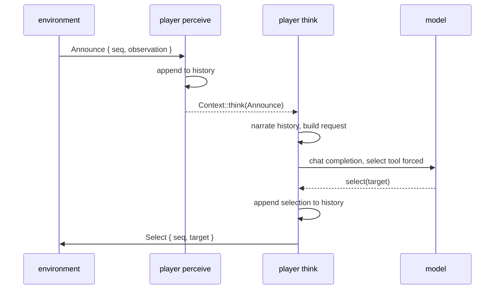

# ADR-0003: The model player

**Status:** Accepted
**Date:** 2026-10-09
**Deciders:** Bill McNeill
**Depends on:** [ADR-0001](0001-games-and-variants-are-modules-and-subcommands.md),
[ADR-0002](0002-actors-perceive-think-and-act.md)

## Context

The model-played variant of Werewolf
([ADR-0001](0001-games-and-variants-are-modules-and-subcommands.md)) needs a
player whose selections are made by a language model. The runtime it sits
on ([ADR-0002](0002-actors-perceive-think-and-act.md)) settles where the
model call happens: in the player's `think` loop, so that `perceive` keeps
running while the model works. The environment announces each phase to the
awake players with `Announce { seq, observation }`, and a player answers
with `Select { seq, target }`, a statement the environment drops if its
number is no longer current.

That leaves what the player itself is: what it remembers, what it shows the
model, how the model selects, and how it reaches the model. ADR-0001 already
settles the configuration: one model for the table, reached through the
OpenAI chat completions protocol, checked at startup against the provider's
model listing and a compiled-in whitelist of models known to make tool
calls; and a system prompt for each player rendered from a template.

Two existing pieces bear on the design. The uniform-random player chooses
from a filtered set of candidates: the living, other than itself, whose
roles it does not know. And the `Narrator` turns the environment's log into
the legible account printed on standard output: the table, then each night
and day with what every player did and how it ended, then who won.

## Decision

**A model player remembers its own log entries, tells them to the model as a
story from its own point of view, and selects with one forced tool call whose
only argument is one of the candidates the random player would choose
from.**

### The player's two loops

`perceive` appends each `Announce` to the player's history and hands it to
`think`. `think` builds a request from the history, calls the model, appends
the selection to the history, and sends the `Select` to the environment
itself. The history lives in the player's one brain, the
`Arc<std::sync::Mutex<…>>` shared by both loops, and neither loop holds the
lock across the model call.

### History is the player's own log entries

A player's history is a list of `Entry` values, the same type and the same
content as the lines the environment logs about that player: an entry for
each observation it was sent, and one for each selection it made. Nothing in
the history is a summary; it is the record of what the player observed and
did, in order.

The environment's log needs one new entry for this. A selection in the
model-played variant is a statement, not a reply, so it is logged as
`Received { from, message }`, beside the existing `Sent` and `Replied`. The
uniform-random variant's entries do not change.

### The model is told a story, from the player's point of view

Before each call, the history is narrated in prose. The narration follows
the same flow as the `Narrator`'s account on standard output: a header for
each night and day, what was done in it, and how it ended. But it is told
from what the player knows, and worded for it:

- **There is no table.** A player is never shown the deal, so the account
  begins with the first phase it sees.
- **Roles are the ones the player knows,** taken from its observations: its
  own, every werewolf's if it is a werewolf, and whoever the seer has
  discovered. Everyone else is a bare name.
- **The player's own deeds are in the second person.** "You vote to kill
  player5." "You protect player2."
- **The seer is told what it learns.** "You learn player5 is a werewolf." On
  standard output the result is part of the seer's line, but a player learns
  it only from its next observation, so its account says so outright.
- **Deaths are told as the `Narrator` tells them,** from who is no longer
  alive: "player3 dies" after a night, "player3 is voted out" after a day,
  "Nobody dies" when the doctor saved the victim.

A player never observes how anyone else voted, so its account has only its
own selections in it. That is all the game's messages carry until players
talk.

The `Narrator` is generalized to tell either account. The omniscient
account it prints today does not change.

### Each call is a fresh request

A call is not a turn in a running chat. Each one is a new request with two
messages:

1. **system:** the player's prompt, rendered once at startup from its
   template (ADR-0001);
2. **user:** the narrated history, followed by where the game stands now:
   the phase and round, and what is being asked of the player.

The history only ever grows at the end, so each request begins with the
previous one. Providers that cache prompt prefixes, OpenAI automatically and
LM Studio locally, cache all but the newest part of every request without
anything being done for it.

### Selecting is a forced tool call

Each request offers one tool:

- **Name:** `select`.
- **Description:** "Knowing everything you know, select the best one."
- **Parameters:** one, `target`, whose JSON schema is an `enum` of the
  candidates.

and sets `tool_choice` to require it, so the model cannot answer with prose
instead.

**The candidates are the random player's.** The living, other than the
player itself, whose roles it does not know. The filter that the
uniform-random player uses today is moved into the shared Werewolf module as
`candidates(me, observation)`, and both players choose from it, so a model
player and a random player in the same seat face exactly the same choice.
This keeps the two variants comparable. It also means a doctor cannot protect
itself, as the random doctor cannot.

If there are no candidates, the player makes no call and no selection.

**A selection that goes wrong is no selection.** No tool call, a malformed
one, or a `target` outside the candidates is an error from `think`, which
ADR-0002 drops. There is no fallback to a random choice. A player that fails
to select has simply not selected.

### The client

The client lives in the `social-deduction` crate, in a module of its own,
`src/model.rs`, beside the tool-call whitelist and outside `werewolf/`. The
Werewolf model player and the `models` command both use it, and so can any
later game in the crate. It is not in `free-agent`, which stays free of HTTP
and model protocols, and it is not a crate of its own yet. What moves up
into a shared crate is decided once the code has settled.

The model is reached over HTTP with `reqwest`, using rustls and its `json`
feature. The request and response types are small hand-written serde structs
covering only the fields used: chat completion messages, tools, `tool_choice`
and tool calls, and the `GET /v1/models` listing. Unknown fields in responses
are ignored, so a provider's additions do not break parsing.

The API key is read from the environment into a `secrecy::SecretString`
(ADR-0001) and exposed only where the `Authorization` header is built.

**Every request has a timeout.** It is a configuration value,
`request_timeout`, with a default of 60 seconds in the code that the file can
override. A request that times out is an error from `think`, and so no
selection, like any other failed call. A model that is merely slow is not
cut off by the phase limit; its late selection is dropped by sequence
number.

The client sits behind a small `Model` trait with one method that takes a
request and returns a response. The model player depends only on the trait. It is called `Model`, not
`Chat`, although the protocol is OpenAI's chat completions: a call here is
one decision, not a conversation, and "chat" is kept for when players
talk.
Tests use `FakeModel`, which returns scripted responses and records the
requests it was sent, so `think` is tested without a network, and continuous
integration never calls a model.

### The log begins with the configuration

An episode of the model-played variant logs its configuration right after
the deal, as a `Configuration` entry. It records everything from the
configuration that bears on how the game was played, as it took effect after
the command line, the file and the defaults were combined:

- the role counts, phase limits and request timeout;
- the provider's base URL and the model's id;
- each seat's persona;
- each player's rendered system prompt, for the role it was dealt;
- the configuration's templates and text blocks as written.

It never records an API key. With this entry, a log says by itself what was
played and under which prompts, without the configuration file that produced
it.

The uniform-random variant's log does not change.

## Alternatives considered

### A running chat

One conversation per player per game, with each observation a new user turn
and each selection an assistant turn. Rejected: the conversation would be
state that only the model provider sees in full, and a request built from
the history each time is the same tokens, cached just as well, with the
player's own record as the one source of truth.

### The omniscient account, verbatim

Show the player exactly what is printed on standard output. Rejected because
that account names every player's role from the first line.

### The history as structured data

Show the model the observations as JSON. Rejected because the model plays
better with a story than a data dump, and the `Narrator` already tells one.

### A selection parsed from prose

Ask the model to name a player and find the name in its answer. Rejected for
a tool call whose argument is constrained to the candidates, which leaves
nothing to parse.

### A random selection when the model fails

Rejected. It would hide a failing model behind plausible play, and mix two
policies in one player's record.

### The client in `free-agent` or a crate of its own

Behind a cargo feature in the library, or as a workspace crate such as
`free-agent-models`, the client would be reusable outside
`social-deduction`. Rejected for now: nothing outside the crate needs it
yet, the library's purpose is game-agnostic plumbing, and moving a
self-contained module into a crate later is mechanical.

### `async-openai`

A complete client for the protocol. Rejected because its strict types tend to
break on the "compatible" endpoints of other providers, and the player uses a
handful of fields that are easy to write by hand.

## Consequences

- **A model player's record is self-contained.** Its history is its own log
  entries, so what the model was shown can be reconstructed from the log.
- **Model and random players face the same choices,** which keeps their
  results comparable.
- **The player's account is thin until there is talk.** It holds its own
  selections, the phases and the deaths, and nothing about how anyone else
  voted.
- **A stale announcement still costs a call.** With messages piling up in
  `think` (ADR-0002), a player that falls behind calls the model for an
  announcement already superseded, and the environment drops the answer.
- **A slow model can hold up its player for a whole timeout.** Messages
  wait in `think` behind a request until it returns or times out.

## Deliberately deferred

1. **Skipping stale announcements** before calling the model.
2. **Logging from think,** including the model's raw responses.
3. **Talk,** and what the player hears of others.
4. **Integration tests against real models** in continuous integration.
5. **Moving the client into a shared crate,** once the code has settled.
