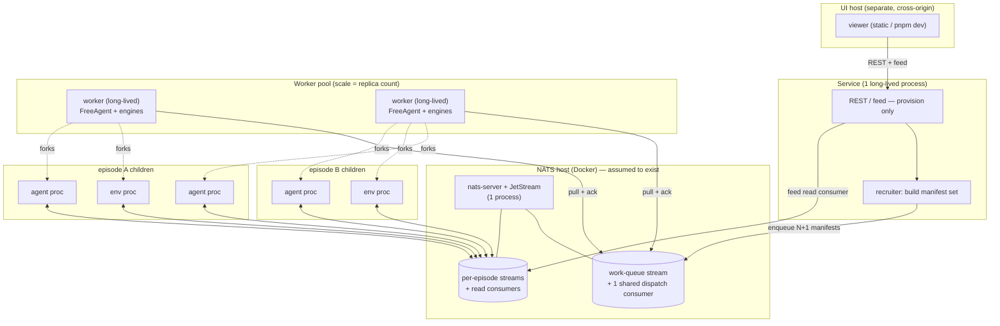
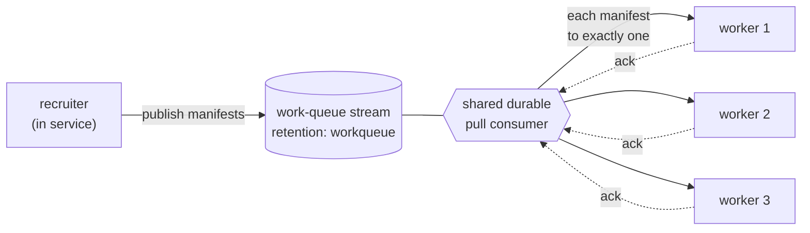
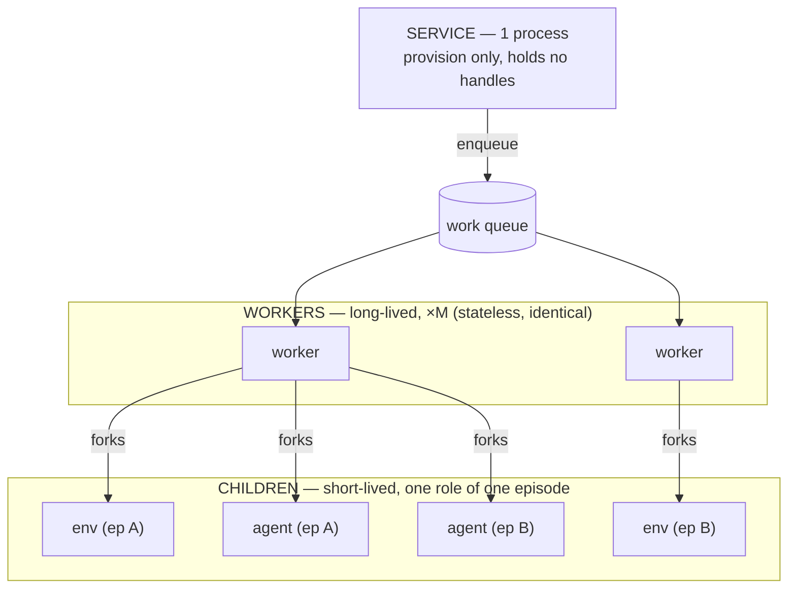
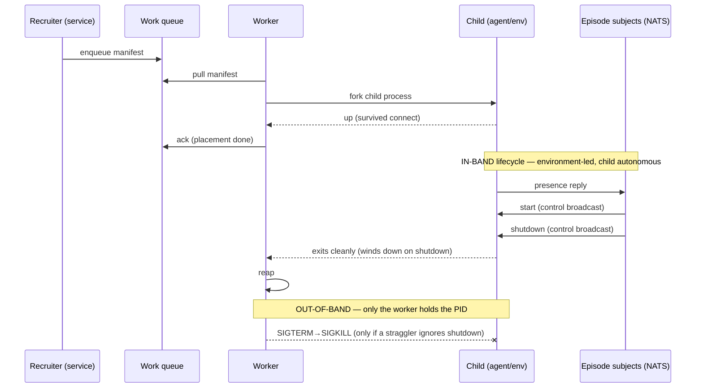
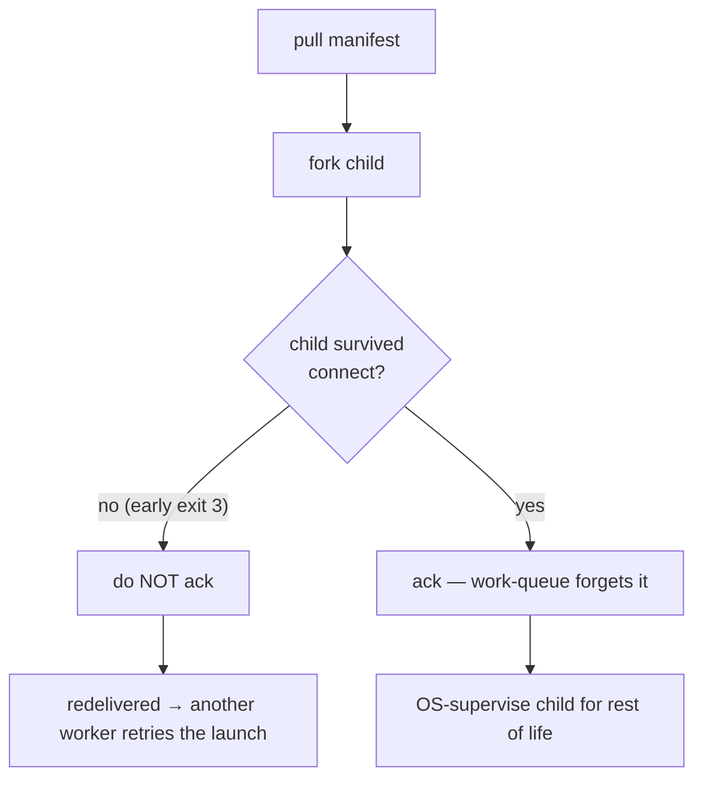
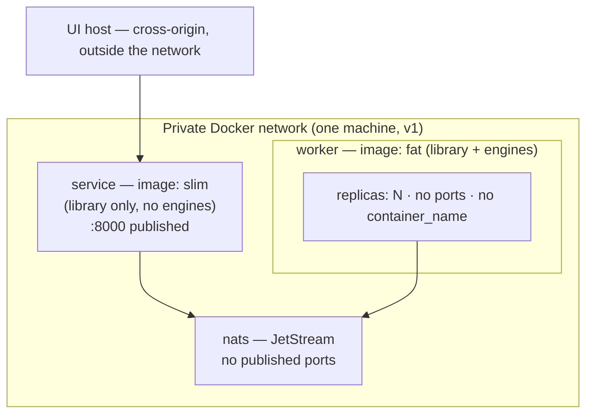

# ADR-0005: The worker pool — distributed episode execution over a work queue

**Status:** Accepted
**Date:** 2026-06-25
**Deciders:** Bill McNeill

## Context

[ADR-0004](0004-app-independent-service.md) made the episode service
app-independent — no UI, no application baked into the image — but it
**deliberately deferred** one question: *who launches the engine?* Its
"Not in scope" section and its open Action Item #5 say so plainly. The service
still launches an episode's agents **in-process, as OS child processes inside
the `freeagent` container**, and `create` / `stop` / status all rely on the live
`EpisodeHandle`s it holds in memory (`cli/orchestrate.py` → `cli/child.py`). Two
consequences ADR-0004 named and accepted as transitional:

- the slim image still must carry each app's *manifest* to resolve the
  workspace, so the service is not yet "runs no app code"; and
- the slim image **cannot actually launch a live episode** — `create` for an app
  whose engine is not installed returns `404 unknown application`, because
  `load_app` runs in-process and the engine is no longer there.

This ADR makes the deferred decision. Two forces push it now. First, **finish
the decoupling honestly:** get engine-launching out of the service so the slim
image is real and the "can't launch" wart is gone. Second, and decisively,
**mass reinforcement learning:** the goal (DESIGN.md) is bulk generation of
training data — *many* concurrent episodes, eventually across a server pool.
Launching every agent as a child of one service process on one machine cannot
spread across machines. The launch path has to become something a pool can do.

Three seeds are already in the codebase, pointing the same way:

- **The child spec is already a serializable manifest.** `cli/child.py` builds
  `{role, class: "module:QualName", subject_root, agent_id, config, nats_url}`,
  passes it to a child process, and that child does exactly
  *import-the-class → instantiate → `asyncio.run`*. It is JSON today. The only
  thing tying it to the local machine is that `module:QualName` must be
  importable where the child runs.
- **`AppSpec` already advertises an app without importing it by name**
  (`cli/apps.py`, ADR-0002) — the library reads what an app *registered*, never
  imports it directly.
- **The recruiter** (DESIGN.md, `recruiter.py`, a v1 stub) is defined as the
  thing that *assembles the roster before the episode exists* and hands it to a
  fresh environment. A roster of manifests is precisely what one would enqueue.

This remains the **trusted local testbed** of ADR-0001/0002/0003/0004:
localhost, no auth, JetStream on a local volume. The v1 target is **one large
machine** (initially a single worker container on a laptop). Multi-machine
distribution is designed *for* but not *enabled* here — it is the point at which
the deferred auth question finally fires (see Scope, below).

## Decision

**An episode's processes are launched by a pool of generic, app-agnostic
*workers* that pull *manifests* off a JetStream *work queue*. The service's
`create` becomes provision-only: it (via the recruiter) enqueues an episode's
manifests and holds no process handles. A worker pulls a manifest, forks one
child process for that role, confirms it is up, acknowledges the message, and
then supervises that child at the OS level for the rest of its life. The
episode's own lifecycle continues to run over NATS, environment-led, exactly as
today.**

This fulfills ADR-0004's Action Item #5. The NATS wire, the per-episode
JetStream stream, the REST contract, the feed, and Parquet edge I/O are all
unchanged: this is a decision about *where launching happens and how work is
distributed*, not about the episode protocol.

### The machine and process map

For v1 everything below runs on **one machine**; the boundaries drawn are the
boundaries that will later become network boundaries unchanged.

Note the two roles a *consumer* plays, easily conflated: the **one shared
dispatch consumer** on the work-queue stream (placement) and the **many read
consumers** on per-episode streams (each agent reading its room, the feed, the
recorder). A child is never a client of the dispatch consumer — by the time it
exists, its manifest has already been pulled.

### The manifest is the unit of work (references code; does not ship it)

Promote the child spec to a first-class, versioned, wire-safe **manifest**: a
role, a `module:QualName` class reference, the constructor config, the episode's
subject root and ids, and the NATS URL. It *references* code by import path; it
does **not** carry code. Therefore the worker that runs a manifest must have the
named engine **installed** — workers are "fat" (FreeAgent + the app engines).
This is the same assumption FreeAgent already makes ("applications are installed
packages"); it means **no app-specific stub** runs anywhere — the only
app-specific thing on a worker is the installed package the manifest names.

A manifest records a **resolved engine version** as provenance once the child
imports it (e.g. `twentyquestions==1.2.3`), written into the episode's durable
record. This is write-only: it gates nothing in v1 (see Scope) but it is the
difference between an RL trajectory you can reproduce and one you cannot —
consistent with "the wire is the log."

### Placement and IPC are one mechanism: the work queue

There is no separate scheduler and no out-of-band control plane for "which
machine." A single **work-queue-retention** JetStream stream holds manifests;
**all workers bind one shared durable pull consumer**; the server hands each
manifest to exactly one worker (competing consumers). Pull — not push — so each
worker fetches only as much as its spare capacity allows: distribution by
capacity, with no central decision-maker.

JetStream guard-rails this shape: a work-queue-retention stream will not let you
create *overlapping* consumers, so "one shared consumer, many bound workers" is
essentially the only available shape — but the worker must **bind** the existing
durable, never create a per-instance one (which would fan every manifest out to
every worker and launch each role N times). Stream and consumer creation is
**idempotent** (ensure-if-not-exists), so N workers can cold-start in any order;
any one may be first, the rest bind.

### Three process tiers

- The **worker** is long-lived and tied to nothing — not per-episode, not
  per-agent. It is a persistent, app-agnostic supervisor that, over its life and
  concurrently, hosts roles from **many** episodes. It never runs agent code
  itself. Launched as `free-agent work`.
- The **child** is short-lived and is exactly **one role of one episode** — one
  agent, or the environment. This is the tier where "one process per
  agent-episode" holds, and it reflects the decision (below) that agents
  run as **separate OS processes, not async tasks** sharing a process: isolation
  over density (a wedged or crashing agent cannot take a neighbour down, and can
  be `SIGKILL`'d).

Relationships: worker ↔ episode is **many-to-many**; child ↔ (agent, episode)
is **one-to-one**.

### Supervision: the environment decides over NATS; the worker enforces at the OS

Lifecycle splits into two planes, and the worker lives in only one of them.

**In-band, over NATS — episode lifecycle.** Presence → `start` → `shutdown`,
environment-led (ADR-0002/0003, DESIGN.md). Children conduct it autonomously: an
agent hears `shutdown` on the control subject and winds itself down. The worker
is invisible here.

**Out-of-band, at the OS — process existence.** Fork, reap, hard-kill. Only the
worker can act — only it holds the child's PID, and this is what children cannot
do for themselves and NATS cannot do at all. The worker **reaps** exited
children (it is their parent) and **escalates terminate→kill** on a straggler
that ignores cooperative shutdown — reusing the escalation `orchestrate.py`
already implements. The environment *decides* (broadcasts shutdown); the worker
*enforces* on whatever will not leave.

So the worker is **launch + reap + enforce, not conduct**. It is a process
supervisor below the NATS lifecycle, not a lifecycle authority above it.

This is consistent with ADR-0003's "JetStream is the truth": we keep only the
worker's *local, ephemeral* parent-child OS handle (irreducible process
hygiene), and store **no durable, cross-machine handle** as state. The durable
record holds the **manifest set + status + resolved versions**, never a PID.

### Acknowledge on confirmed creation

A worker acks once its child is **confirmed up** — survived past its connect
phase — **not** on bare `fork` and **not** on role completion.

The work-queue's unit of work is **placement of a launch**, discharged the
instant the role is running — not tracking an episode. So `ack_wait` covers only
*startup* (seconds), never an episode's full duration. Failure interlocks:

- worker dies **before** ack → launch never completed → manifest redelivers →
  another worker launches the role (at-least-once *for the launch*, the only
  guarantee the queue should make);
- worker dies **after** ack → in the one-process-per-container model the child
  dies with it and the queue does not redeliver → the role simply **vanishes**
  from a live episode → the environment's presence/liveness notices the missing
  participant and **aborts the episode** cleanly.

"Ack on confirmed creation" and "a lost role aborts the episode" are the same
decision from two sides. Ack-on-completion is affirmatively wrong: its only
purpose would be to *re-run a role mid-episode*, but a re-run role rejoining a
live episode is the duplicate-join the environment's presence-nonce check
(DESIGN.md) is built to reject.

### Deployment: two images, one package

The one `freeagent` library gains a second entry point — `free-agent work`
alongside `free-agent serve` — and ships as **two images**:

- **service (slim):** library only, *no* engines (the ADR-0004 image, now
  honestly slim — it launches nothing, so it never needs an engine). Owns the
  REST/feed surface; no longer needs `orchestrate`/`child`.
- **worker (fat):** library **plus the installed app engines**; runs
  `free-agent work`; needs none of FastAPI/uvicorn.

The package is **not** split in v1 (one consumer of the seam is not enough to
justify it); the web stack may optionally move behind a `[service]` extra so the
worker image omits it. Workers are stateless, publish no ports, and must **not**
set `container_name` (which forbids replicas). Scaling is `--scale worker=N`
today and the identical image at `replicas: N` on a cluster later; the
autoscaling signal, when wanted, is **work-queue depth** (`num_pending`).

### Scope: what is deliberately *not* built

- **One machine; security deferred.** Within one private network every worker
  reaches `nats://nats:4222` and the trusted-local posture (ADR-0001..0004)
  holds. The moment workers span machines, NATS must be reachable off-box and
  the long-deferred **auth** question fires — that is the boundary, and it is not
  crossed here. (NATS/JetStream provides accounts, per-subject permissions, and
  nkey/JWT creds for when it is.)
- **Homogeneous, sufficient pool; no version pickiness.** Workers do not check
  versions or capabilities; they import and run what a manifest names. The pool
  is assumed homogeneous (every worker has every installed engine) and
  sufficient. This deletes a whole class of machinery — dispatch-time version
  guards, nack-and-redeliver-on-mismatch, capability routing.
- **Heterogeneity is a later move, and it lives in the recruiter + dispatch, not
  the worker.** When "an agent with property X" (a version floor being the
  simplest such property) is wanted, the recruiter emits property-tagged
  manifests and dispatch grows capability-filtered consumers so a tagged manifest
  only reaches a capable worker. The worker stays the dumb, app-agnostic
  supervisor forever.

## Options Considered

### Who launches an episode's processes

| Option | Assessment |
|--------|------------|
| **A worker pool pulling manifests off a work queue (chosen)** | Distributable to a server pool; the service goes pure-provision; placement is free (competing consumers); finishes ADR-0004's decoupling — the slim image launches nothing, so it needs no engine. |
| Keep launching in-process in the service (ADR-0002/0004 status quo) | Simplest, but cannot spread across machines (the mass-RL goal), and keeps the engine manifest in the service image — the wart ADR-0004 accepted only as transitional. |
| `create` invokes an external runner synchronously | Removes in-process launch but reintroduces a bespoke control channel and a held relationship; the work queue already *is* the runner-plus-placement. |

### Placement and inter-process dispatch

| Option | Assessment |
|--------|------------|
| **One JetStream work queue, one shared pull consumer (chosen)** | Placement, flow control, and IPC are one mechanism; competing consumers do load-balancing with no scheduler; scales by replica count. |
| A separate scheduler/placement service | A whole new stateful component to decide machines — exactly the layer the work queue removes. |
| Out-of-band control subjects per worker | A bespoke protocol and a registry of workers; the queue needs neither. |

### What a manifest carries

| Option | Assessment |
|--------|------------|
| **A reference (`module:QualName` + config + version stamp); workers have engines installed (chosen)** | The manifest stays pure data; no code shipping; matches "apps are installed packages"; no app-specific stub anywhere. |
| Ship the engine code to the worker with the manifest | Lets a worker run an app it lacks, but needs sandboxing and dependency resolution — a far larger ADR, unneeded for a homogeneous pool. |

### How an agent runs on a worker

| Option | Assessment |
|--------|------------|
| **A forked child OS process per role (chosen)** | Strong isolation; a wedged/crashing agent cannot take down neighbours and can be `SIGKILL`'d; smallest delta from `child.py`. |
| An in-process asyncio task per agent | Higher agent-per-machine density, but couples agents' fates within a worker, has no per-agent kill, and fights the fat-worker model (one loop running many apps' code). |

### When the worker acknowledges

| Option | Assessment |
|--------|------------|
| **On confirmed creation (chosen)** | The queue tracks placement, not episodes; `ack_wait` covers startup; interlocks with "a lost role aborts the episode." |
| On pull (at-most-once) | A child that fails to start is silently lost with no retry. |
| On role completion (at-least-once) | Holds the message in-flight for the whole episode (absurd `ack_wait`) and would re-run a role into a live episode — the duplicate-join the presence-nonce check rejects. |

### Cross-machine process handles

| Option | Assessment |
|--------|------------|
| **None stored; truth is JetStream + the queue; only local parent-child handles (chosen)** | Restart-safe and machine-agnostic, consistent with ADR-0003; a launcher holds no distributed state. |
| Store handles as episode metadata | Reintroduces the machine-local, restart-losing coupling ADR-0002→0004 worked to delete; a handle to a pooled process is meaningless after a launcher restart. |

## Trade-off Analysis

The decisive trade is **a new worker tier and a work-queue stream vs.
distributability and an honestly-decoupled service.** It is more than ADR-0004's
in-process launch — but the design *removes* as much as it adds: no stored
handle (truth stays in JetStream), no placement scheduler (competing consumers),
and, by assuming a homogeneous sufficient pool, no version-guard/routing layer.
Net new machinery is one stream, one shared consumer, and a `free-agent work`
loop that is mostly the existing `child.py` wrapped in a pull and a confirm-up
ack.

Robustness comes from **process isolation** (child per role) and the
**two-plane** split: cooperative NATS shutdown for the normal case, a worker
holding the real PID for the stragglers — the only place an OS kill can happen.
Reproducibility comes from the **resolved-version stamp**, free because it gates
nothing.

Horizontal scaling is not a later feature but the architecture itself: stateless
identical workers, one shared consumer, self-contained manifests, no role
assuming co-location. The same image runs at `replicas: 1` on a laptop and
`replicas: N` on a cluster; only the number differs. Security stays a non-concern
**only while single-machine** — the design draws the machine boundary now so the
later network boundary needs no redrawing, but auth genuinely arrives with the
first off-box worker.

## Consequences

- **Easier:** the service is finally pure substrate (provision + read, no
  engines, no handles, ADR-0004's wart resolved); episode execution spreads
  across a pool by replica count with no scheduler; mass-RL is "fill the queue,
  scale the pool"; the manifest is reproducible provenance; the same images lift
  to a cluster unchanged.
- **Harder / new work:** a new worker process and image to build, run, and
  monitor; idempotent ensure-stream/ensure-consumer with a correctly-bound
  shared durable; confirm-up ack timing; wiring "a lost role aborts the episode";
  two deployment artifacts where there was one; the recruiter graduates from stub
  to enqueuer.
- **Watch / revisit:** auth and non-local NATS the instant the pool goes
  multi-machine; heterogeneous/versioned dispatch (recruiter-tagged manifests +
  capability-filtered consumers) when a non-uniform pool is wanted; work-queue
  depth as an autoscaling signal; clustered NATS and object-store (not
  node-local volumes) for Parquet when storage crosses machines.

## Action Items

1. [ ] Define the **manifest** schema (single-sourced from Pydantic, per the #39
       pipeline): role, `module:QualName`, config, subject root/ids, NATS URL;
       plus a resolved-version field stamped at import.
2. [ ] Build `free-agent work`: connect NATS, **idempotently** ensure the
       work-queue stream and **bind the shared durable pull consumer**, pull →
       fork child (`child.py`) → confirm up → ack → OS-supervise (reap +
       terminate→kill); `SIGTERM` stops pulling and enforces shutdown locally.
3. [ ] Recruiter graduates from stub to **enqueuer**: build an episode's manifest
       set and publish it to the work queue.
4. [ ] Service `create` becomes **provision-only**: call the recruiter, hold no
       `EpisodeHandle`; drop in-process launching from the service path. The
       service no longer needs `orchestrate`/`child`.
5. [ ] Episode durable record carries the **manifest set + status + resolved
       versions** (no PID); wire "a lost role aborts the episode" via the
       existing presence/liveness + operator-abort path.
6. [ ] **Worker image** (fat: library + engines) + a `worker` service in compose
       (`replicas`, no `container_name`, no published ports); optionally move the
       web stack behind a `[service]` extra so the worker image omits it.
7. [ ] Update DESIGN.md and the READMEs: the two-image backend, the worker tier,
       and the "fill the queue, scale the pool" execution model.
